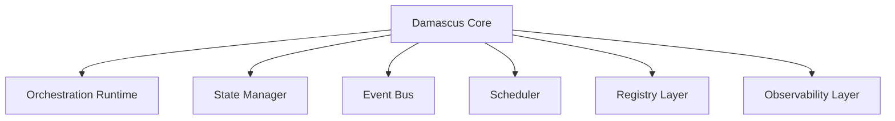
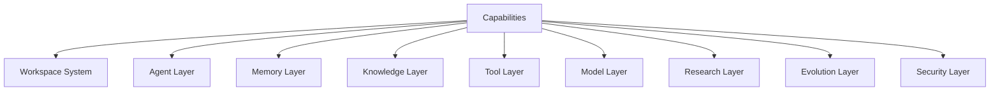
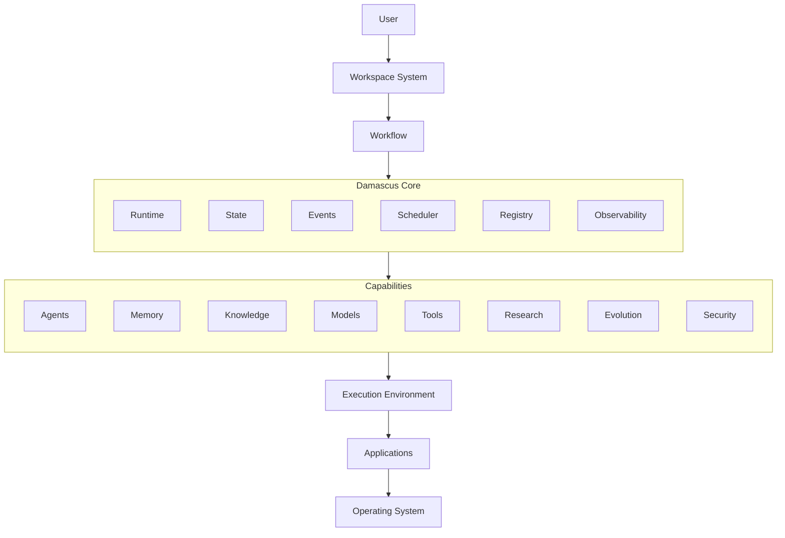

# High-Level-Architecture.md

Version: 0.2

Status: Architecture Foundation

Priority: Critical

---

# Purpose

This document defines the high-level architecture of Damascus.

The goal is not to describe implementation details.

The goal is to establish the major architectural systems, their responsibilities, boundaries, and interactions.

Future architecture documents will expand each subsystem individually.

---

# Architectural Philosophy

Most AI systems are built around agents.

Typical architecture:

User
↓
Agent
↓
Tool
↓
Result

Damascus intentionally takes a different approach.

The platform is designed around workflows, state, memory, and evolution.

User
↓
Workspace
↓
Workflow
↓
Execution
↓
Learning
↓
Evolution

The architecture is built around the belief that:

Current AI systems execute tasks.

Damascus improves how tasks are executed.

---

# Core Architectural Principles

## Local First

User data should remain local whenever possible.

Cloud infrastructure should be optional.

---

## Model Agnostic

No subsystem should depend directly on a specific model provider.

Models are replaceable resources.

---

## Workspace Centric

The primary organizational unit is a workspace.

Not a conversation.

Not an agent.

---

## Workflow Centric

The primary execution unit is a workflow.

Agents, tools, models, approvals, and benchmarks exist inside workflows.

---

## Memory As Infrastructure

Memory is a foundational system used by every major subsystem.

---

## Evolution Through Measurement

Improvement requires evidence.

Every important capability should be benchmarkable.

---

## Human Authority

Users retain ultimate control.

Autonomy never overrides ownership.

---

# System Overview

Damascus consists of three major architectural domains.

1. Core Infrastructure
2. Capability Systems
3. Execution Environment

---

# Core Infrastructure

The Core Infrastructure provides the operational foundation of Damascus.

These systems coordinate execution but do not provide intelligence themselves.

---

# Capability Systems

Capability systems provide intelligence functionality.

---

# Execution Environment

The execution environment provides controlled interaction with external systems.

Examples:

* Applications
* Browsers
* IDEs
* Docker Containers
* APIs
* Operating Systems

---

# High-Level Architecture

---

# Core Infrastructure

## Orchestration Runtime

Purpose:

Execute workflows.

Responsibilities:

* workflow execution
* coordination
* checkpointing
* recovery
* lifecycle management

The runtime executes workflows through a runtime interface.

Initial implementation:

LangGraph Runtime Adapter.

The architecture must remain independent of LangGraph-specific concepts.

---

## State Manager

Purpose:

Maintain workflow execution state.

Responsibilities:

* execution state
* workflow state
* checkpoint state
* recovery state

---

## Event Bus

Purpose:

Enable subsystem communication.

Examples:

* Workflow Started
* Workflow Completed
* Benchmark Finished
* Memory Updated
* Research Discovered

The Event Bus becomes the communication backbone of Damascus.

---

## Scheduler

Purpose:

Control execution priorities and resource allocation.

Responsibilities:

* queue management
* resource allocation
* concurrency control
* background job execution

---

## Registry Layer

Purpose:

Store metadata describing system capabilities.

Registries include:

* Workflow Registry
* Agent Registry
* Tool Registry
* Model Registry
* Benchmark Registry
* Research Registry

Registries are discovery systems.

Not memory systems.

---

## Observability Layer

Purpose:

Provide transparency and learning infrastructure.

Track:

* execution traces
* failures
* performance
* costs
* benchmark results
* evolution events

Observability enables future evolution.

---

# Capability Systems

## Workspace System

Organizational boundary.

Contains:

* projects
* tasks
* workflows
* memories
* benchmarks

---

## Agent Layer

Provides specialized reasoning and execution capabilities.

Agents operate inside workflows.

Agents are not the primary architectural unit.

---

## Memory Layer

Provides long-term intelligence infrastructure.

Supports:

* working memory
* episodic memory
* semantic memory
* procedural memory
* evolution memory

---

## Knowledge Layer

Maintains relationships between entities.

Likely implemented through knowledge graphs.

Answers:

"What is connected?"

---

## Tool Layer

Provides operational capabilities.

Examples:

* terminal
* browser
* git
* docker
* file system

---

## Model Layer

Provides access to reasoning providers.

Supports:

* local models
* commercial models
* future providers

through a common abstraction layer.

---

## Research Layer

Acquires new knowledge.

Supports:

* paper analysis
* repository monitoring
* technique extraction
* knowledge synthesis

---

## Evolution Layer

The defining subsystem of Damascus.

Responsibilities:

* workflow evolution
* benchmark evaluation
* variant generation
* promotion decisions

The Evolution Layer improves workflows over time.

---

## Security Layer

Provides protection and governance.

Responsibilities:

* permissions
* approvals
* sandboxing
* auditing
* encryption

Security applies across all layers.

---

# Intelligence Flow

User Goal
↓
Workspace
↓
Workflow
↓
Runtime
↓
Execution
↓
Observability
↓
Memory
↓
Evolution
↓
Improved Workflow

This transforms execution into learning.

---

# Evolution Flow

Workflow
↓
Execute
↓
Observe
↓
Measure
↓
Generate Variants
↓
Benchmark Variants
↓
Compare Results
↓
Promote Winner
↓
Update Procedural Memory

This is the core Damascus improvement loop.

---

# Architectural Constraints

## Constraint 1

Workflows are the primary execution unit.

---

## Constraint 2

Agents are workflow components.

Not architectural roots.

---

## Constraint 3

Memory survives agents.

---

## Constraint 4

Models are replaceable.

---

## Constraint 5

Execution must remain observable.

---

## Constraint 6

Execution must remain recoverable.

---

## Constraint 7

Security boundaries may never be bypassed.

---

## Constraint 8

The Core must remain runtime-independent.

---

## Constraint 9

Evolution may improve workflows.

Evolution may not modify security policies.

---

## Constraint 10

Human authority remains final.

---

# Key Insight

Most AI systems are agent-centric.

Damascus is workflow-centric.

Most AI systems execute tasks.

Damascus evolves how tasks are executed.

This distinction defines the architecture of the platform.
